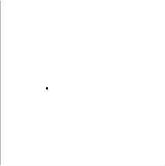

PerioR-Tree
====
[](https://travis-ci.org/ToruNiina/periortree)

An extension of R-Tree[1](#References) for Periodic Boundary Condition.

PerioR-Tree is a header-only library depending on Boost C++ Library.

The user-interface is inspired by Boost.Geometry library[2](#References).



## Example

inserting spheres into rtree with your own position type

```cpp
#include <your_own/position.hpp>
#include <your_own/sphere.hpp>

#include <periortree/rtree.hpp>

inline rectangle<position> make_aabb(sphere const& sph)
{
    return rectangle<position>(sph.center,
            position(sph.radius, sph.radius, sph.radius));
}

int main()
{
    // for value_type, 
    typedef std::size_t identifier_type;
    typedef std::tuple<perior::rectangle<position>, sphere, identifier_type
            > value_type;

    // periodic boundary conditions you applied
    perior::cubic_periodic_boundary<position> boundary{
        /* lower bound = */ position{ 0, 0, 0},
        /* upper bound = */ position{10,10,10}
        };

    // the R-Tree to contain the value
    perior::rtree<
        /* value type = */ value_type,
        /* parameter  = */ perior::quadratic<12>,
        /* boundary   = */ perior::cubic_periodic_boundary<position>
        > tree;

    std::vector<sphere> spheres;
    /*
     * here codes to prepair spheres ...
     */

    // insert all the spheres to the R-Tree
    for(std::size_t i=0; i<spheres.size(); ++i)
    {
        tree.insert(std::make_tuple(make_aabb(spheres.at(i)), sphere.at(i), i));
    }

    rectangle<position>     rect(position(5., 5., 5.), position(1., 1., 1.));
    std::vector<value_type> detected;

    // search the spheres that possibly intersects to the rectangle `rect`
    tree.query(perior::query::intersects_box(rect), std::back_inserter(detected));

    // output all the candidates that possibly intersects to the rectangle
    for(const auto& q : detected)
    {
        std::cout << "sphere with ID " << std::get<2>(q)
                  << " possibly intersects to the rectangle" << std::endl;
    }

    return 0;
}
```

## References

1. Guttman, A. (1984) "R-Trees: A Dynamic Index Structure for Spatial Searching"
2. Barend G., Bruno L., Mateusz L., Adam W., Menelaos K., and Vissarion F. (2009) [Boost.Geometry](http://www.boost.org/doc/libs/1_65_0/libs/geometry/doc/html/index.html)

## Citation

http://arxiv.org/abs/1712.02977
